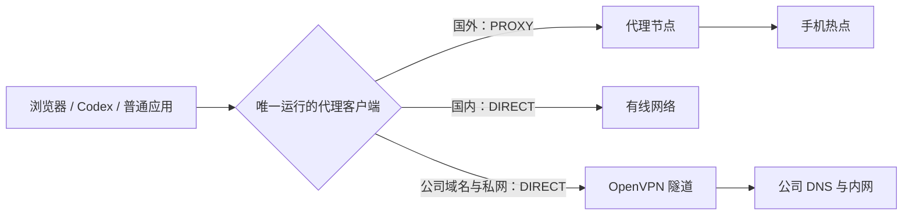

# Windows 多网络分流笔记

> 在一台 Windows 电脑上同时使用有线网络、手机热点、代理客户端和 OpenVPN，让国内、国外、公司内网各走正确的出口。

## 目标拓扑



核心并不是“让所有流量都进 VPN”，而是两层分流：

1. 代理规则先决定 `DIRECT` 或 `PROXY`。
2. Windows 路由表再决定直连流量从有线、手机热点还是 OpenVPN 出去。

## 四条原则

1. v2rayN、Clash Verge、悠兔同一时间只运行一个。
2. 三个客户端可统一 Mixed 端口，例如 `127.0.0.1:7897`，前提是不能同时启动。
3. 多网卡叠加 OpenVPN 时，默认关闭代理客户端的 TUN，优先使用系统代理和 Rule 模式。
4. OpenVPN Connect 的 `Proxy` 保持 `None`，不要让 OpenVPN 连接依赖本机代理端口。

## 三个客户端的对照配置

| 项目 | v2rayN | Clash Verge | 悠兔 |
|---|---|---|---|
| 本地入口 | Mixed/HTTP `7897` | Mixed Port `7897` | Mixed Port `7897` |
| 工作模式 | 绕过大陆/PAC | Rule | Rule |
| 系统代理 | 自动配置代理 | 开启 | 开启 |
| TUN | 关闭 | 关闭 | 关闭 |
| 国内流量 | 直连 | `GEOSITE/GEOIP CN` | `GEOSITE/GEOIP CN` |

统一端口只是为了让浏览器、命令行和桌面程序不必随客户端切换而修改配置。它不是让三个客户端同时监听一个端口。

## 最小路由规则

将真实公司域名替换成占位符，公开提交时不要泄露内部域名：

```yaml
rules:
  - DOMAIN-SUFFIX,<COMPANY_DOMAIN>,DIRECT
  - GEOIP,PRIVATE,DIRECT
  - GEOSITE,CN,DIRECT
  - GEOIP,CN,DIRECT
  - MATCH,PROXY
```

规则顺序很重要。公司域名和私网规则必须位于最终的 `MATCH,PROXY` 前。

## OpenVPN 配置

- 配置档的 `Proxy` 选择 `None / 无代理`。
- 由公司 VPN 服务端下发客户端地址、内网路由和公司 DNS。
- 如果存在 `DNS Fallback`，建议关闭，避免内部域名回退到公共 DNS。
- 代理规则将公司域名判为 `DIRECT` 后，Windows 路由表才有机会把目标流量送入 OpenVPN。

## DNS 配置

代理客户端的普通域名可使用国内 DoH：

```text
https://doh.pub/dns-query
```

悠兔建议：

- DNS 模式：`normal`
- IPv6：关闭（用于简化多网卡排错；确认 IPv6 路由稳定后可再开启）
- PreferH3：关闭
- 主“域名服务器”：加入 `https://doh.pub/dns-query`
- 公司域名策略：`+.<COMPANY_DOMAIN> → <COMPANY_DNS>`

公司域名策略仅在 OpenVPN 已连接、公司 DNS 可达时生效。公开文档中必须使用占位符。

## 将代理节点固定到手机热点

当有线与热点同时在线时，为当前节点服务器建立 `/32` 主机路由：

```powershell
route -p add <NODE_IP> mask 255.255.255.255 <HOTSPOT_GATEWAY> if <INTERFACE_INDEX> metric 1
route print <NODE_IP>
```

参数含义：

| 参数 | 示例含义 |
|---|---|
| `<NODE_IP>` | 当前所选代理节点的服务器 IP，不是目标网站 IP |
| `<HOTSPOT_GATEWAY>` | 手机热点提供的 IPv4 网关 |
| `<INTERFACE_INDEX>` | Windows 中手机热点网卡的接口编号 |

节点、连接方式或热点网关改变后，旧命令不能直接照抄。

### 查询默认网关和接口编号

```powershell
Get-NetIPConfiguration |
Where-Object { $_.IPv4DefaultGateway } |
Format-List InterfaceAlias,InterfaceIndex,IPv4Address,IPv4DefaultGateway,DNSServer
```

### 查询悠兔当前远程连接

```powershell
$proxyPids = @(Get-Process YouTuCore,YouTu -ErrorAction SilentlyContinue |
  Select-Object -ExpandProperty Id)

Get-NetTCPConnection -State Established -ErrorAction SilentlyContinue |
Where-Object {
  $proxyPids -contains $_.OwningProcess -and
  $_.RemoteAddress -notin @('127.0.0.1','::1','0.0.0.0','::')
} |
Select-Object OwningProcess,LocalAddress,LocalPort,RemoteAddress,RemotePort |
Format-Table -AutoSize
```

大量、持续连接到同一远程 IP 和非标准服务端口的记录，通常是代理节点；`443` 连接也可能只是订阅更新、DNS 或连通性检测，应结合客户端节点详情确认。

## Codex CLI

当前 PowerShell 会话临时使用统一代理端口：

```powershell
$env:HTTP_PROXY = 'http://127.0.0.1:7897'
$env:HTTPS_PROXY = 'http://127.0.0.1:7897'
$env:ALL_PROXY = 'http://127.0.0.1:7897'
$env:NO_PROXY = 'localhost,127.0.0.1,::1'
codex
```

启动前验证端口：

```powershell
Test-NetConnection 127.0.0.1 -Port 7897
```

只有结果为 `TcpTestSucceeded : True` 时，才应让程序使用该端口。代理客户端关闭后，指向该端口的程序会得到“连接被拒绝”。

## 排错顺序

1. 确认只有一个代理客户端运行。
2. 确认 Mixed 端口正在监听。
3. 确认代理客户端处于 Rule 模式，TUN 关闭。
4. 确认节点服务器的 `/32` 路由指向手机热点。
5. 确认 OpenVPN 的 Proxy 为 None，并已下发公司路由与 DNS。
6. 确认公司域名命中 `DIRECT`，私网 IP 没有被送入 `PROXY`。
7. 最后再排查 DNS、IPv6、Fake-IP 等变量。

## 仓库内容

- `README.md`：公开、可复用的技术笔记。
- `docs/index.html`：适合浏览器阅读和后续改成公众号文章的版本。
- `docs/current-network-setup.md`：当前电脑实际网络配置、原理、文件位置和排错复盘。
- `docs/network-architecture-and-vps.html`：总架构图、VPS 部署流程和安全风险说明。
- `examples/mihomo-rules.yaml`：脱敏的规则片段。
- `scripts/diagnose.ps1`：只读诊断脚本。
- `scripts/set-youtu-wifi-route.ps1`：自动识别悠兔节点并固定到 Wi-Fi 的管理员脚本。
- `private.local.md`：本机真实参数，已被 `.gitignore` 排除。

## 自动固定悠兔节点到 Wi-Fi

先连接手机 Wi-Fi 热点并启动悠兔，产生一次代理流量，然后以管理员身份运行：

```powershell
powershell -ExecutionPolicy Bypass -File .\scripts\set-youtu-wifi-route.ps1
```

脚本会：

1. 自动读取 `WLAN` 的 IPv4、网关和接口编号。
2. 从 `YouTuCore` 的已建立连接中寻找连接数达到阈值的非标准远程端口。
3. 收集这些端口对应的全部公网节点 IP，兼容切换节点后多个连接暂时并存的情况。
4. 检查并添加指向 Wi-Fi 网关的持久 `/32` 路由。
5. 候选 IP 数量异常时停止，不盲目修改路由。

只预览、不修改路由：

```powershell
powershell -ExecutionPolicy Bypass -File .\scripts\set-youtu-wifi-route.ps1 -NoApply
```

已知节点端口时，可减少误判：

```powershell
powershell -ExecutionPolicy Bypass -File .\scripts\set-youtu-wifi-route.ps1 -NodePort 30031
```

手动指定节点 IP：

```powershell
powershell -ExecutionPolicy Bypass -File .\scripts\set-youtu-wifi-route.ps1 `
  -NodeIp <NODE_IP_1>,<NODE_IP_2> `
  -NodePort <NODE_PORT>
```

## 发布前检查

- 搜索并移除公司域名、公司 DNS、内网 IP、节点 IP、订阅地址和用户名。
- 不提交 `.ovpn`、订阅 YAML、客户端日志或截图原图。
- 命令全部使用 `<PLACEHOLDER>`，避免读者误抄本机参数。
- 说明静态路由需要管理员权限，并提醒节点切换后需要更新。

## 当前 Clash Verge 配置索引（2026-09-24）

当前采用“远程订阅 + 覆写模板”的方式，不要把远程订阅文件和覆写内容手工重复合并，否则会出现 `duplicate name`。

Clash Verge 安装目录：

```text
D:\Program Files\Clash Verge
```

用户配置目录：

```text
C:\Users\11756\AppData\Roaming\io.github.clash-verge-rev.clash-verge-rev
```

关键文件：

```text
profiles.yaml                         # 当前订阅及覆写模板关联
profiles\Rf4SxaWArEv3.yaml             # 悠兔远程订阅（更新时会被重写）
profiles\pbfpRUSgwVjH.yaml             # VPS 代理覆写
profiles\gccbkMr7KodN.yaml             # VPS 代理组覆写
profiles\rkWdhCQ9Svzf.yaml             # OpenAI/GitHub/国内/悠兔规则覆写
verge.yaml                             # Clash Verge 界面设置
config.yaml                            # 运行时基础端口设置
```

端口约定：

```text
Clash HTTP/Mixed：127.0.0.1:7897
Clash SOCKS：    127.0.0.1:7896
旧 v2rayN：      127.0.0.1:7898（不再作为系统代理）
```

分流逻辑：

```text
ChatGPT / Codex / OpenAI / GitHub → VPS-OpenAI-Git
Google 等其他境外网站             → 悠兔
国内网站、微信、ToDesk、OpenVPN   → DIRECT
```

注意事项：

- 远程悠兔订阅会自动更新；VPS 和规则应放在覆写模板中。
- 同一个代理名或代理组名只能出现一次；不要同时把 VPS 直接写入远程订阅和覆写模板。
- 只有手机 Wi-Fi 连接时，悠兔节点路由脚本才能把节点固定到 WLAN；切换节点后需要重新运行 `scripts\set-youtu-wifi-route.ps1`。
- 当前使用 Clash Verge 时，保持规则模式、系统代理开启、TUN 关闭；IPv6 建议关闭以避免绕过 IPv4 分流。
